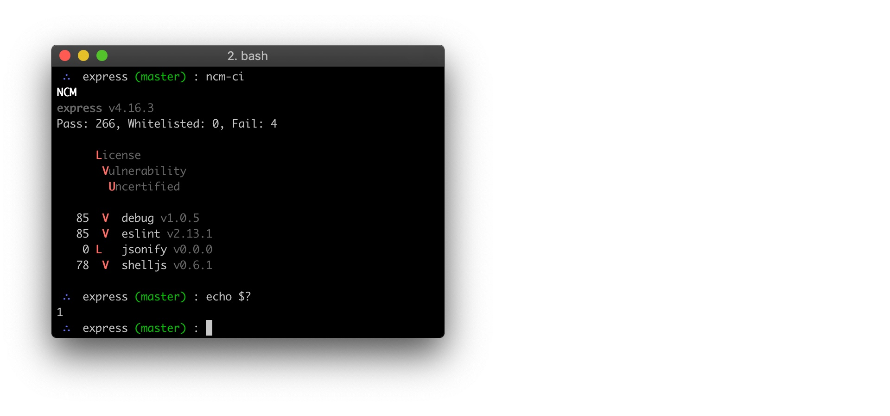

# @nodesource/ncm-ci

[](https://travis-ci.org/nodesource/ncm-ci)

[NCM](https://nodesource.com/products/certified-modules) for CICD systems.

- [Read the docs](https://docs.nodesource.com/ncm_v2/docs#ci-overview)
- [Check out an example repository set up with ncm-ci](https://github.com/nodesource/ncm-ci-example)
- [__Sign up for a professional tier account to get started!__](https://accounts.nodesource.com/)

## Usage

```bash
$ cd express
$ NCM_TOKEN=token ncm-ci
NCM
express v4.16.3
Pass: 266, Whitelisted: 0, Fail: 4

      License
       Vulnerability
        Uncertified

   85  V  debug v1.0.5
   85  V  eslint v2.13.1
    0 L   jsonify v0.0.0
   78  V  shelljs v0.6.1
   
```



The tool will exit with a non-0 exit code if one or more dependencies failed
the certification check.

```bash
$ ncm-ci
$ echo $?
1
```

## Installation

```bash
$ npm install -g @nodesource/ncm-ci
```

## License & copyright

Copyright &copy; NodeSource.

Licensed under the MIT open source license, see the LICENSE file for details.
