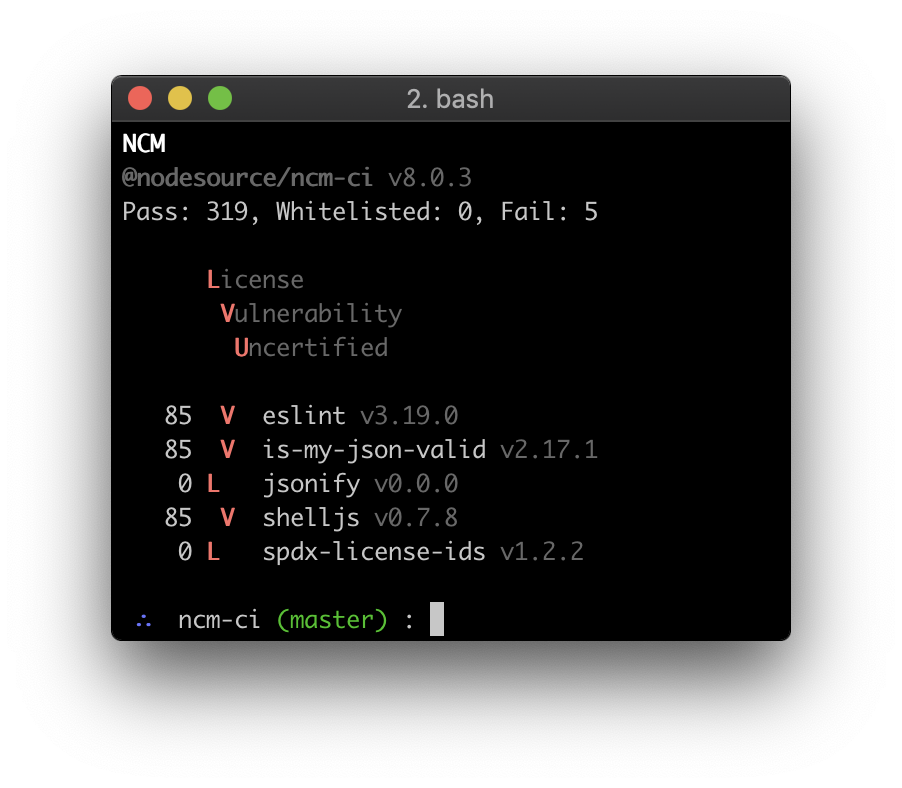

# @ns-private/ncm-ci
CI tool for [NCM 2.0](https://github.com/nodesource/ncm)

[](https://us-west-2.console.aws.amazon.com/codebuild/home?region=us-west-2#/projects/ncm-ci-ci/view)

## Usage

```bash
$ cd some-project
$ NCM_TOKEN=token ncm-ci
NCM
@ns-private/ncm-ci v7.0.0
Pass: 322, Whitelisted: 0, Fail: 17

      License
       Vulnerability
        Unlicensed

    0   U @mrmlnc/readdir-enhanced v2.2.1
    0   U acorn v5.4.1
    0   U acorn-node v1.5.2
    0   U builtins v2.0.0
    0   U cross-fetch v2.0.0
    0   U es5-ext v0.10.38
    0   U es6-weak-map v2.0.2
   85 LV  eslint v3.19.0
    0   U event-emitter v0.3.5
   85 LV  extend v1.3.0
    0  V  is-my-json-valid v2.17.1
    0 L   jsonify v0.0.0
    0   U read-package-json v2.0.13
   85 LV  shelljs v0.7.8
    0 L   spdx-license-ids v1.2.2
    0   U terser v3.9.2
    0   U uglifyify v5.0.1

```



## Installation

```bash
$ npm install -g @ns-private/ncm-ci
```
